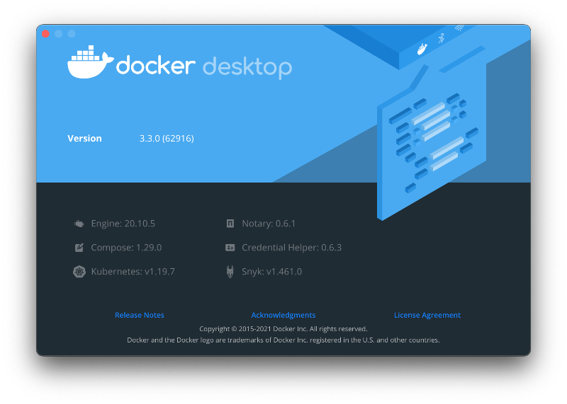
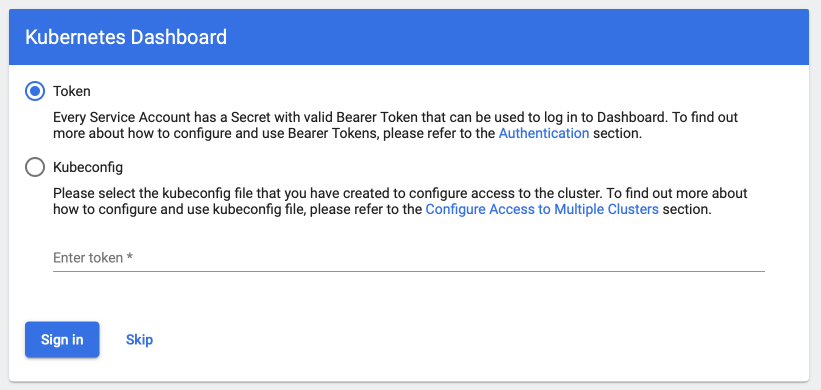
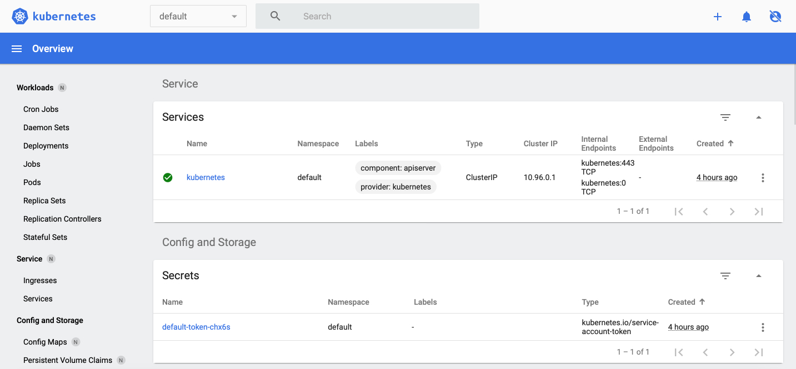
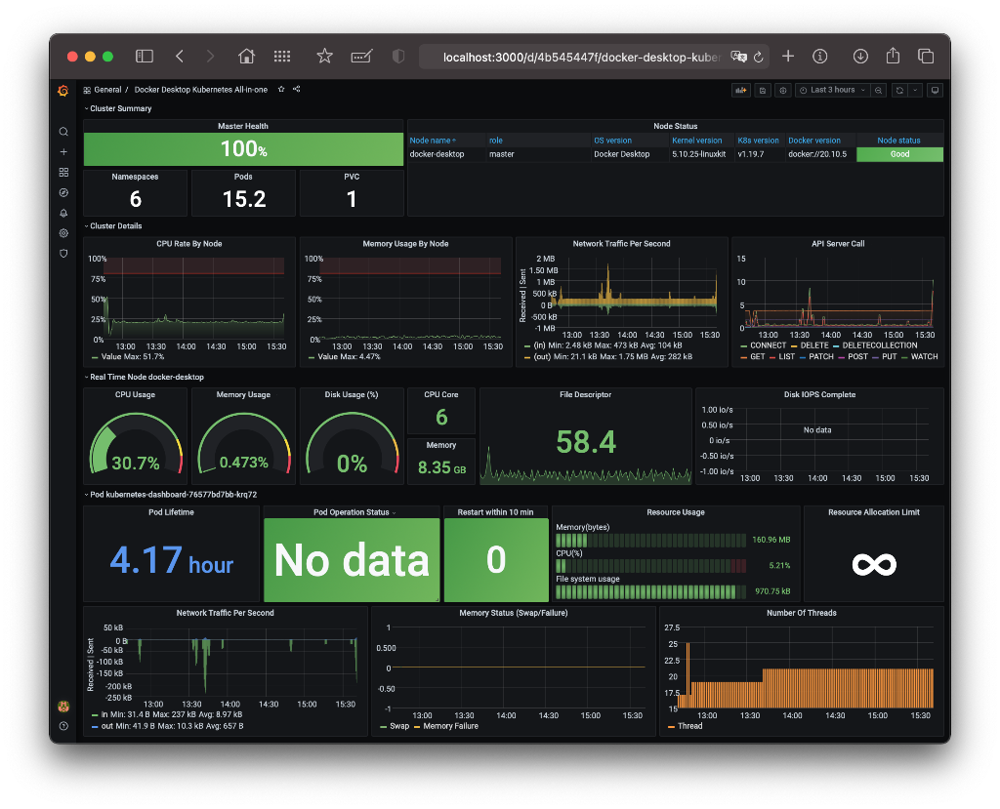

# Locally install Kubernetes with essential components

> 
> This procedure is working on macOS indeed - and it's a great deal. Hope this work on others systems with some 
> modification, but I can't guarantee.

>
> I kept all YAML configuration files in this repository [@TODO](). I will specify where they come from and
> what modification has been included when necessary.


## Kubernetes

* I'm using `Docker for Desktop` which you can find obviously at https://www.docker.com/products/docker-desktop

  

* After installation, you can grapple basic information from your cluster:

```shell
% kubectl cluster-info
```
```shell
% kubectl get ns
``` 

- Or even:
  
```shell
% kubectl get all -A
```
> **Note the `-A`**
> 
> Since Kube `1.14`, we don't have to use the `--all-namespaces` anymore! So don't...


## Kubernetes Dashboard

Dashboard is a web UI of k8s API and provide an easy way to visualize and debug things:
  https://github.com/kubernetes/dashboard
  

### Installation

By default, Dashboard is protected by a token, and each time you'll access it, you'll be asked to provide one. It could 
really be annoying in the long run. Fortunately, Kubernetes dashboard allows you to bypass the login page by adding `--enable-skip-login` to the 
configuration.

> The repository configuration file is patched with this instruction (ligne198) 

> Obviously don't do this in production!

To deploy Dashboard (without token authentication), execute following command:
```
% kubectl apply -f ./k8s/dashboard-v2.2.0-recommended.yaml
```
Then to access Dashboard from your local workstation you must create a secure channel to your Kubernetes cluster. To do 
so, run the following command:
```
% kubectl proxy
```
And access the Dashboard at:

http://localhost:8001/api/v1/namespaces/kubernetes-dashboard/services/https:kubernetes-dashboard:/proxy/

> Don't forget to bookmark the URL!

You will see this page:



Now you can `skip` the authentication.



## Metrics-Server

Metrics-Server is used to crop metrics from k8s components and expose them to k8s API:
  https://github.com/kubernetes-sigs/metrics-server

Metrics Server serves the goals of core metrics pipelines: CPU and RAM. It's a cluster level component which 
periodically scrapes metrics from all Kubernetes nodes served by Kubelet. When installed, Kubernetes Dashboard displays
this metrics.

To allow Metrics Server to collect its data over https, the original script has been modified to accept insecure TLS
connections by adding `- --kubelet-insecure-tls` ligne 133.

> Once again, don't do this in production!

Apply the patched configuration by entering :
```
% kubectl apply -f k8s/metrics-server-components-v0.4.2.yaml
```

When reloading the Dashboard, you should now see CPU and Memory Usages!

For example, go to the `Pods` section:


## Kube State Metrics

Unlike Metrics Server, Kube State Metrics is focused on generating numerous metrics from Kubernetes' object state (e.g. metrics based 
on deployments, replica sets, pods, etc.). It holds an entire snapshot of Kubernetes state in memory and continuously 
generates new metrics based off of it.

Having kube-state-metrics enables access to these metrics from monitoring systems such 
as Prometheus.

To install Kube State Metrics, launch the following:
```
% kubectl apply -f k8s/kube-state-metrics-v2.0.0-rc.1.yaml
```

## Prometheus

As specified in the documentation, Metrics Server is useful for:

- CPU/Memory based horizontal autoscaling
- Automatically adjusting/suggesting resources needed by containers

But when its comes to:

- Have an accurate source of resource usage metrics
- Manage Horizontal autoscaling based on other resources than CPU/Memory

You should check out full monitoring solutions like Prometheus (https://prometheus.io).

In a few words, Prometheus is a monitoring and alerting system which:
- Collects data identified by a metric name
- Stores time-series in memory and on local disk for efficiency
- Allows notifications and alerting depending on data queries

### Installation

Prometheus' maintainers provide binaries and Docker images for Prometheus components. 
With a bit of elbow grease, it is possible to create a k8s configuration file with everything we need:
- Access to resources we want to monitor at cluster level
- Role dedicated to Prometheus
- Prometheus executable configuration
- Docker image deployment
- Exposition through service
- And some specific paths due to Docker Desktop for Mac! 🥵

To run the Prometheus configuration, run the command:
```
% kubectl apply -f k8s/prometheus.yaml
```

You can now access Prometheus interface at:
http://localhost:30000/

## Grafana

[Grafana](https://grafana.com/grafana/) allows you to query, visualize and alert on metrics through a powerful user interface.



To install Grafana, run the command:
```
% kubectl apply -f k8s/grafana-datasource.yaml
% kubectl apply -f k8s/grafana.yaml
```

Grafana will be listening on http://localhost:3000. The default login is "admin" / "admin".

> Note:
> 
> Configuring a dashboard in Grafana could be long, costly, and time-consuming. Collecting metrics depends on your host, 
VM/Virtualization Framework and the OS on your pod.

You own a Mac, you're running Docker Desktop and have followed this guide : you can import this 
[dashboard](k8s/Docker Desktop Kubernetes All-in-one-1618321310777.json) right now to start monitoring your K8S cluster!